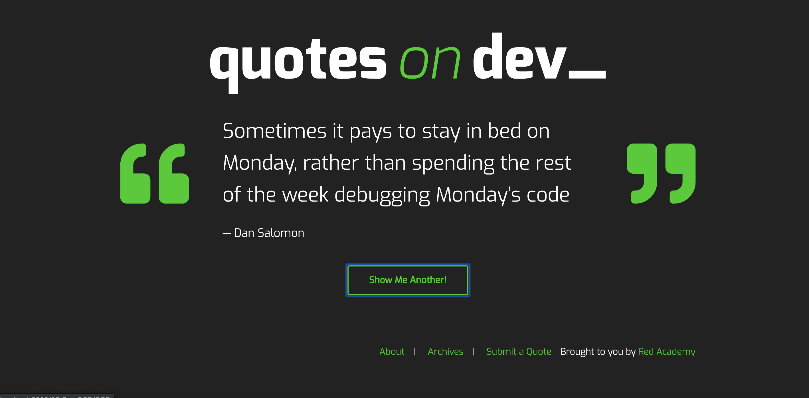
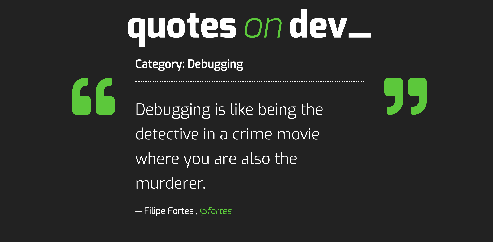

# Quotes on Dev - Custon Wordpress Theme 

## About This Project

A custom WordPress theme created for the Quotes on Dev website, a site that allows users to generate a random quote, search for quotes, and submit their own if they are logged into Wordpress. 
 
The Quotes on Dev Theme used Wordpress as a CMS, as well as PHP, jQuery, CSS and HTML.

## Personal Learnings 
This project was such a relief after working on Inhabitent, and I found that I was able to work with Wordpress templates and the structure, and SASS variables and mixins a lot more easily. I also really enjoyed the JavaScript compontant -- it was a challenge, but very rewarding when I finally figured it out. 
 
## Screenshots

 

### Installation

#### 1. Download me (don't clone me!)

Then add me to your `wp-content/themes` directory.

##### 2. Rename the `quotesondev-starter-master` directory

Make sure that the theme directory name is project appropriate! Do you need `starter` or `master` in the directory name?

##### 3. Install the dev dependencies

Next you'll need to run `npm install` **inside your theme directory** to install the npm packages you'll need for Gulp, etc.

##### 4. Update the proxy in `gulpfile.js`

Lastly, be sure to update your `gulpfile.js` with the appropriate URL for the Browsersync proxy (so change `localhost[:port-here]/[your-dir-name-here]` to the appropriate localhost URL).

And now would be a good time to `git init` :)
